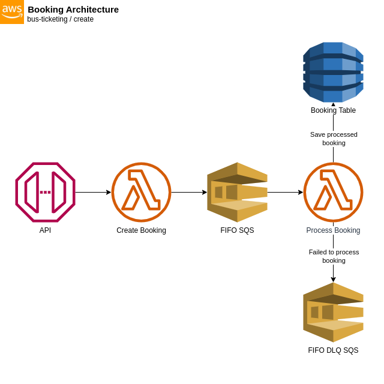

# Create Booking Architecture

The architecture shown above shows illustrates the process of creating a booking record. When a client sends a request, the **API Gateway** serves as the entry point, receiving the incoming requests.

The request is then forwarded to a **Lambda Function**, which acts as the backend processing unit. This Lambda Function is responsible for processing and validating the received data. Once the data is processed, it is passed to a Simple Queue Service (SQS) FIFO for further handling.

The **SQS FIFO** serves as a buffer or intermediary storage for the processed data. It ensures reliable delivery of messages and provides a queuing mechanism. Upon receiving the data, the SQS FIFO triggers a second **Lambda Function** specifically designed to store the data into a **DynamoDB Table**.

If the processing of the data fails in the initial attempt, it will automatically retry the processing up to a ***maximum of five (5) retries***. This allows for potential transient failures to be overcome. However, if the processing fails even after the maximum retries, the data is sent to a DeadLetter SQS FIFO.

The **DeadLetter SQS FIFO** acts as a holding area for failed messages. It serves as a way to capture and store the data that could not be processed successfully. This provides an opportunity for further investigation or manual intervention to handle any exceptional cases.