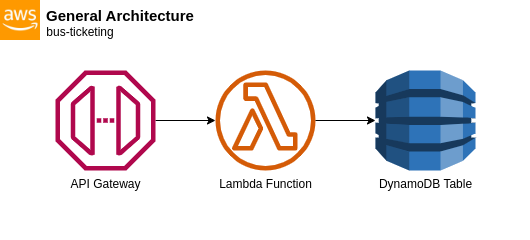

# General Architecture

The most common AWS architecture in this application involves the usage of a **Lambda Function** triggered by an API Gateway request. The **API Gateway** serves as the entry point for incoming requests from the clients, while the Lambda Function acts as the backend processing unit. After processing the requests that came from the client it will store the data to a **DynamoDB Table**.

Some requests may require specific parameters to be provided in the request, such as query parameters or path variables. These parameters provide additional context or information for the Lambda Function to process.

Certain requests may include a payload that needs to be processed by the Lambda Function. The payload should be in a JSON format and holds the necessary information for the intended processing.

In some cases, requests may not require any specific request parameters or payload. These requests might trigger the Lambda Function to perform a certain action or retrieve data from other sources without any additional input.