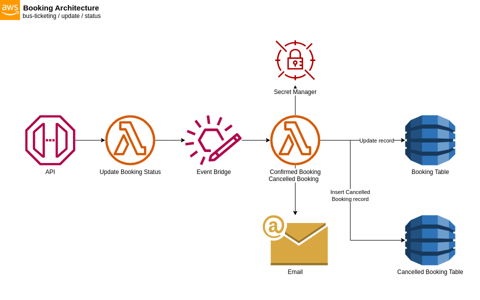

# Update Booking Status Architecture



The architecture shown above illustrates the process of updating the booking status into either "`CONFIRMED`" or "`CANCELLED`" based on client requests. When a client sends a request, the **API Gateway** serves as the entry point, receiving the incoming requests.

The request is then forwarded to a **Lamba Function**, which acts as the backend processing unit. This Lambda Function is responsible for processing and validating the received data. Once the data is processed, it is passed to a custom EventBridge.

The **custom EventBridge** acts as an event routing mechanism, allowing it to be sent to different targets based on the specified event patterns. In this architecture, if the event received by the EventBridge matches the "`booking:confirmed`" event pattern, it will be routed to the ***Confirmed Booking Lambda Function***. On the other hand, if the event matches the "`booking:cancelled`" event pattern, it will be routed to the ***Cancelled Booking Lambda Function***.

Both the Confirmed Booking Lambda Function and Cancelled Booking Lambda Function are responsible for processing and validating the data received from the EventBridge. After processing, it will send an email to the client about the booking transaction where the Lambda Function fetches the Email Configuration on the **Secrets Manager** and update the corresponding record in the **DynamoDB Table** to reflect the updated booking status.

To ensure reliability and fault tolerance, if the processing of the data fails during the initial attempt, the system will automatically retry the processing up to a ***maximum of five (5) retries***. This retry mechanism helps overcome potential transient failures, allowing the system to eventually process the data successfully.

### Email Secrets Manager
The e-mail configuration needs to be manually created in the **Secrets Manager** as an "**Other type of secret**". You have two options for storing the configuration: a key/value pair or plaintext.

When entering the e-mail configuration, make sure to follow the [expected format](#e-mail-configuration-format). For a key/value pair format, you must use JSON format. Alternatively, if you choose to store the e-mail configuration as plaintext, you can simply enter the configuration details in a single line or multiple lines.

Once the e-mail configuration is created, make sure to ***copy the Secret ARN***, which uniquely identifies the secret. You can find the ARN in the Secrets Manager console.

Next, open the `bus-ticketing-stack.ts` file located in the `lib/stacks` directory. Look for the placeholder value '`YOUR_AWS_SECRETS_MANAGER_ARN`' and replace it with the copied Secret ARN. This step links the application to the correct e-mail configuration stored in the Secrets Manager.


#### E-mail Configuration format
```json
{
  "server_address": "smtp_server_address",
  "port": "smtp_port",
  "username": "email_username",
  "password": "email_password",
  "customer_support": "your_customer_service_email"
}
```

Where:
* `server_address` is the Outgoing Mail (SMTP) server address that should be used for sending e-mails
* `port` is the Outgoing Mail (SMTP) port that should be used for the e-mail server
* `username` is the e-mail username that will be used for authentication
* `password` is the e-mail application password associated with the e-mail account
* `customer_support` is the e-mail addres of your customer support service, which will be used for customer inquiries or support related e-mails

